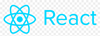

<h1 align="center"><a name = "header">Grocery Specials Web App</a></h1>
<div align="center">

[](/LICENSE)


<p float="left">
<a href="https://patreon.com/cagross"></a>
<a href="https://www.paypal.com/donate?business=EM8N9N647HGSU&no_recurring=0&currency_code=USD"></a>
<a href="https://www.buymeacoffee.com/cagross"></a>
</p>
</div>

<hr>

This browser-based app allows users to search for grocery stores in a particular area, then fetches the current specials from those stores. After, it does the following:

- Displays the specials on a web page, in a filterable list.

- Calculates and displays the unit cost of each item.

- Allows users to select their favorite items, as well as a threshold price on each item. The app will then email the user once any of those items go on sale for less than their threshold price.

This app is a port of a web app I previously built.  The [original app](https://github.com/cagross/react-specials) was built upon the MERN tech stack, and this new app is built upon a C# based tech stack. This new app will continue to use the exact same UI, i.e. the React component of the previous app will remain in-place for this app. As such, this particular project will not focus on edits to the UI.

For a working demo of this app, please visit: https://specialscapi20230823213803.azurewebsites.net/. 

## 📝 Table of Contents

- [About](#about)
- [Technology Stack](#technology_stack)
- [Installation](#installation)
- [Usage](#usage)
- [Deploy](#deploy)
- [Edits](#edits)
- [Tests](#tests)
- [To-Do List](#to_do_list)
- [Authors](#authors)

## 🧐 About <a name = "about"></a>

Eating frugally is a goal for many people. For those that cook at home a good strategy is to wait for your favorite food items to go on sale at a local grocery store, then stock up on those items. But how do you know when your favorite items are on sale? The only way is to visit the store's website and look through the [weekly circular](https://circular.giantfood.com/flyers/giantfood?type=2&show_shopping_list_integration=1&postal_code=22204&use_requested_domain=true&store_code=0774&is_store_selection=true&auto_flyer=&sort_by=#!/flyers/giantfood-weekly?flyer_run_id=406535) for your favorite item--which may or may not be present--then repeat the process for <i>all other</i> area stores. This is quite tedious.

The two components of this app help alleviate these issues:

- Browse component: Displays the weekly specials for multiple stores in a single list, which is easy to browse, search, etc.
- Notify component (optional): Automatically emails you when your favorite items go on sale for below a threshold price. For example, you can receive an email whenever ribeye steaks go on sale for less than $5.00/lb.

_Note: Currently the notify component uses the weekly specials from only one single grocery store chain. See the footnote in the [Usage section](#usage) for more information._

## :information_source: Technology Stack <a name = "technology_stack"></a>

|                                                                                                             |                                     |                                                                                                                    |
| ----------------------------------------------------------------------------------------------------------- | ----------------------------------- | ------------------------------------------------------------------------------------------------------------------ |
|  | [ReactJS](https://reactjs.org/)     | Web Framework. I used the [Create React App project](https://github.com/facebook/create-react-app) to get started. |
|   | [.NET](https://dotnet.microsoft.com/)      | Server environment                                                                                                 |
|  | [ASP.NET Core](https://learn.microsoft.com/en-gb/aspnet/core/?view=aspnetcore-8.0/)   | Web server environment                                                                                             |
|   | [C#](https://learn.microsoft.com/en-us/dotnet/csharp/) | Programming language                                   |
|  | TBD (PostgreSQL?) | Database                                                                                                           |
<!-- |  | [MongoDB](https://www.mongodb.com/) | Database                                                                                                           | -->

## ⛏️ Installation and Configuration <a name = "installation"></a>

This section should help you get a copy of the project up and running on your local machine for development and testing purposes. The instructions are separated into those which setup the app's browse component, and those which setup the app's notify component. Neither component is required, i.e. you can configure the browse component for use without configuring the notify component (and vice versa).

### Prerequisites

<!-- - Access to a valid GMail account (or other email account allowing you to send emails). Required for the notify component only.
- Ability to create a MongoDB Atlas database (any plan--including the free plan--should be sufficient). -->

### Install the Project

1. Clone: Clone this GitHub project to your local machine. Here are more resources on how to do that:

- [Git Basics - Getting a Git Repository](https://git-scm.com/book/en/v2/Git-Basics-Getting-a-Git-Repository)
- [`git-clone` documentation](https://git-scm.com/docs/git-clone)

<!-- 2. Install Dependencies: After the project has been cloned to your local machine, install the project's Node dependencies. To do so, from your command line navigate to the project's root directory and execute:

`npm install`

This should complete without any errors (warnings are OK). Then, from your command line navigate to the project's `client` directory and execute:

`npm install`

This should complete without any errors (warnings are OK). -->

<!-- ### Configure the browse component

1. Add environmental variables: On your local system, create the following environmental variable:

| variable name     | variable value                                             |
| ----------------- | ---------------------------------------------------------- |
| SP_SESSION_SECRET | String of text of your choosing. Length: 20-50 characters. |

### Configure the notify component

Configuring this component is a little trickier, and admittedly fragile for now. I want to improve it. But for now, drop me a message if you get stuck.

1. Using a MongoDB plan (a free plan should suffice), create two different MongoDB databases using [MongoDB Atlas](https://www.mongodb.com/cloud/atlas). The database names should be:

- `sp_back`
- `connect_mongodb_session_test`

2. To your `sp_back` database, add a collection named:

`users`

3. Ensure the `users` collection has the following fields and types.

| field name | type       |
| ---------- | ---------- |
| name       | String     |
| email      | String     |
| meat       | String     |
| th_price   | Decimal128 |
| password   | String     |

4. To your `connect_mongodb_session_test` database, add a collection named:

`mySessions`

5. Ensure the `mySessions` collection has the following fields and types.

| field name | type   |
| ---------- | ------ |
| expires    | Date   |
| sessions   | Object |

6. Obtain access to a Gmail account that will allow access from a third party app. To configure a Gmail account to allow access from a third party app, see [these instructions](https://support.google.com/mail/answer/185833?hl=en-GB).

If you cannot setup a Gmail account, it _is_ possible to use a non-Gmail account. But if you do so, you will have to manually make edits to the project file `client/notification_system/notification_system.js`. Specifically, you'll have to edit the object passed to `createTransport()` and ensure it reflect the details of your email provider.


7.  On your local system, create four environmental variables:

| variable name | variable value                                             |
| ------------- | ---------------------------------------------------------- |
| SP_DB_USER    | _Username for your newly created database._                |
| SP_DB_PASS    | _Password for your newly created database._                |
| SP_EMAIL_USER | _Username for your email account._                         |
| SP_EMAIL_PASS | _Password for your email account (or Gmail app password)._ | -->

## 💻 Usage <a name="usage"></a>

### Use the browse component

1. Start the web server listening on port 7165. To do that, from the command line, navigate to the project's root directory and execute:
```bash
cd SpecialsCSharp; dotnet run
```
The app can also be started from within Visual Studio.

2. Open your browser to `http://localhost:7165` and it should display the app's browse component. You should see something similar to the screenshot depicted in at the very top of this README ([link here](#header)).

On the screen should be a small search form, requiring you to enter a US zip code and a radius (in miles). Once a search is executed, and results are found, all of the items from the deli/meat department should be listed--for all stores in the search area. In addition, each item will also display its details, price, and if possible, unit price.

_Note: If search results are not displayed, and you are located outside of the U.S., you may need to enable a VPN and set the VPN's country to the U.S._

_Note: For now, due to performance concerns, the store search feature limits results to three stores._

To filter results by different meat types (beef, poultry, or pork), use the large radio buttons on the page.

_Note: For now, the browse component is best viewed on desktop devices. The layout is quite broken at tablet/mobile screen widths._

### Use the notify component
#### The notify component has not yet been ported to this tech stack. To see a working demo, please see the [MERN version of the app](https://github.com/cagross/react-specials).
<!-- #### First, create a user. To do so, carry out the following steps:

a) Start the web server listening on port 5555 (if it is not already doing so). To do that,from your command line navigate to the project's root directory and execute:

`npm start`

That should complete without issue, with output reading: `Server running on port 5555.`

b) In your browser, navigate to: `http://localhost:5555/register`. Complete and submit the registration form on the page. That should complete without error. If so, you will have created a user for yourself.

#### Next, execute a manual test of the notify component. To do so, carry out the following steps:

a) From your command line navigate to the project's root directory and execute:

`node dev/runNotify.js`

That should complete without error. If so, an email should be sent to your user's email address, listing which items from this week's specials meet the user's criteria (i.e. meat type and threshold price).

For example, let's say you created a user with with the following data:

| field           | value                |
| --------------- | -------------------- |
| Username        | john.doe@example.com |
| Meat Preference | poultry              |
| Threshold Price | 7.0                  |

When you execute the above command from the command line, an email will be sent to john.doe@example.com. The email will contain a list of all items from this week's specials that satisfy all of the following criteria:

- meat type is poultry.
- unit price less than or equal to $7.00 per pound.

If you receive this email, the manual test of the notify component has passed :-)

#### Finally, (if desired) configure the notify system to run automatically. To do so, carry out the following steps:

Since new circulars are released once a week, the logical schedule for the notify component is to run it once a week. But you are free to run it with any frequentcy you desire. The following section can help you setup the notify component to automatically run once a week at 12:00 AM Sunday UTC.

There are several different ways to ensure the notify component runs automatically. In my case, since I have deployed a working demo of my app to cyclic.sh (see [Deploy](#deploy) section), I have made use of cyclic's Cron feature to automatically run the notify component once a week. To be clear, this applies only to the app deployed to cyclic--it does not apply to my local app. To use this approach, first deploy your app to cyclic.sh, then carry out the following steps:

- Open your cyclic dashboard's cron tab and create a new scheduled request. Fill out all fields exactly as they are filled out in the screenshot below, then save.

## 

After, your notifiction system should automatically run once a week at midnight UTC.

Other app hosting services may offer similar scheduling features. For example, if you deploy your app to Heroku, they have a [Heroku Scheduler](https://devcenter.heroku.com/articles/scheduler) feature which can execute custom code on a set schedule.

_Note: In its current state, the notify system fetches weekly specials from one specific grocery store: a Giant Food grocery store in Falls Church, VA, USA._ -->

## :memo: Making Edits <a name="edits"></a>

- Front-end edits: The UI component, i.e. the React front-end, has been copied directly from [the MERN app](https://github.com/cagross/react-specials) (into the SpecialsCSharp\wwwroot\ folder).  As such, it is not possible to make any edits.  The only way would be to install the MERN app, make UI edits there, rebuild the React app from that app, then copy the static React files to this app.

- Back-end edits: The back-end files consist of files in the following folders, all in the SpecialsCSharp folder: Controllers, Helpers, and Models. Note that after making edits you will need to rebuild/restart the app.

## 🚀 Deploy and Demo <a name="deploy"></a>

I have deployed a working demo of this app to a live server, hosted by Microsoft Azure. The app can be viewed in a browser [here](https://specialscapi20230823213803.azurewebsites.net/). From there you can use the browse component of the app.

<!-- From there you can use the browse component of the app, as well as register for an account. After registration, users should receive a weekly email from the notify component. -->

## :heavy_check_mark: Automated Tests <a name = "tests"></a>

The automated tests are currently a mix of unit tests and end-to-end tests. See below for more information on each.

### Prerequisites

If you are located outside of the U.S., some automated end-to-end tests may fail. To resolve, you will need to enable a VPN and set the VPN's country to the U.S.

All automated end-to-end (E2E) tests are meant to run in Google Chrome. Before running the tests you must first install the correct Selenium WebDriver for Chrome.  Follow the steps below to do that.

#### Check the required ChromeDriver version

* Open the SpecialsxUnitProject.csproj file in your project.
* In the file, look for the `<PackageReference>` element that includes the Selenium.WebDriver.ChromeDriver package. The version number specified in this element indicates the required ChromeDriver version.

#### Install the correct ChromeDriver version
* Visit the [official ChromeDriver download page](https://sites.google.com/chromium.org/driver/).
* Download the ChromeDriver version that matches the requirement specified in your project file.
* After downloading, unzip or extract the ChromeDriver binary from the archive file (if applicable).
* Place the ChromeDriver binary in a directory that is included in your system's PATH environment variable. This ensures that the test framework can locate the binary when you run the E2E tests.

#### Verification
* To verify that ChromeDriver is installed correctly, open your command-line terminal and run the following command:

```
chromedriver --version
```
If installed correctly, this command should display the ChromeDriver version and confirm that it's working.

### Running Tests

To run all automated tests from the command line, navigate to the project's root directory and execute:
```bash
cd SpecialsxUnitProject; dotnet test
```
After, output should be printed to the console, similar to this screenshot:


Automated tests can also be executed from Visual Studio, or (with some additional configuration) VSCode. There you should have more control to run only the automated tests of your choosing.

### Unit Tests

Unit tests are implemented using the XUnit testing framework and can be found in the `UnitTests.cs` file located within the SpecialsxUnitProject directory. 

### End-To-End Tests

End-to-end (E2E) tests for this application are automated using Selenium. The test scenarios are defined in dedicated test methods, and XUnit serves as the testing framework to execute these tests. The tests are defined in the file SpecialsxUnitProject\GrocerySpecialsTest.cs.

## 📋 To-Do List (last updated 17 Jan 2024) <a name="to_do_list"></a>

Here is a list of features/fixes I would like to implement soon:

- Port of remaining unit tests.
- Addition of database component and port of the notification system.

## ✍️ Authors <a name = "authors"></a>

- Carl Gross ([@cagross](https://github.com/cagross))
